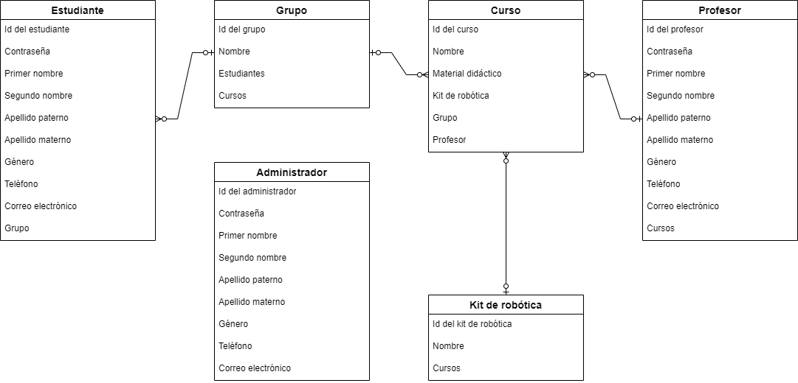

# Actividad 7 y Tarea 6 de “Diseño de aplicaciones web”.

Estas actividades nos enseñan a realizar migraciones y utilizar seeders y factories dentro de Laravel.

El diagrama ER de las actividades:

